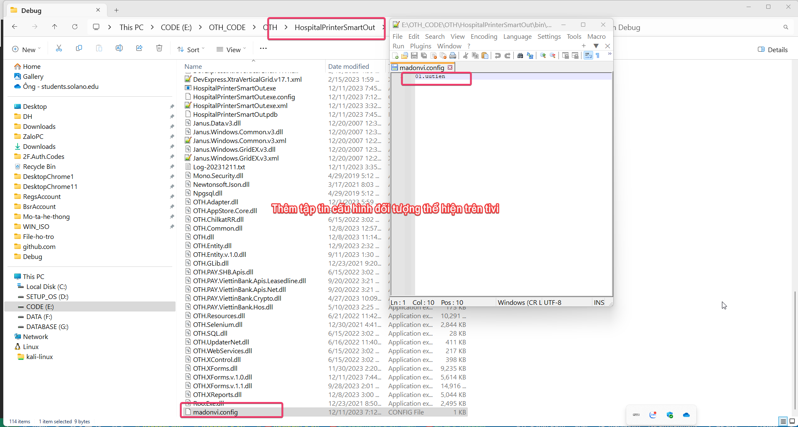
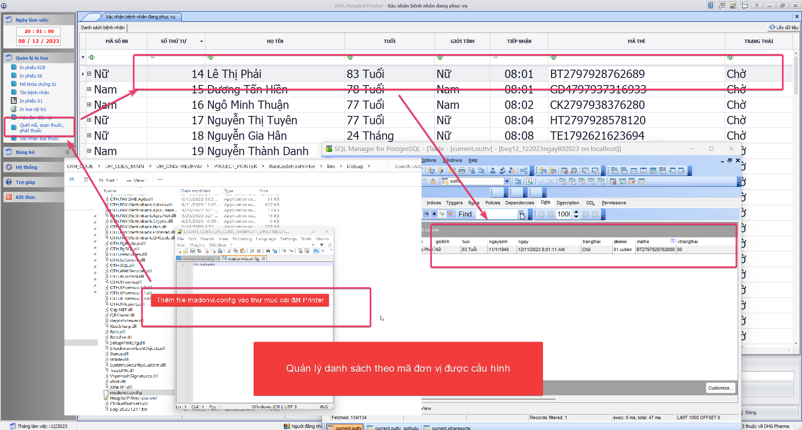
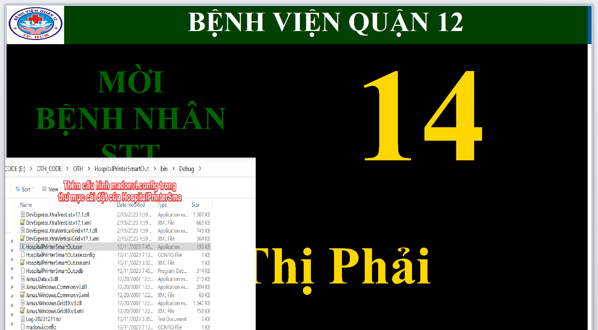

### HospitalPrinterSmartOut - Thông tin cập nhật

(✨: Chức năng mới,🐛: Chỉnh lỗi, #️⃣: Giải quyết công việc) 

-  #️⃣: https://github.com/dh-hos/dhg.hospitalprinter/issues/54 [OK]
-  ✨: Bổ sung chức năng chọn tivi để thể hiện thông tin ra tivi [OK]

-  #️⃣: https://github.com/dh-hos/dhg.hospitalprinter/issues/73 [OK]
-  🐛: Fix lỗi không thể hiện được form thể hiện số thứ tự bệnh nhân ra tivi [OK]

-  ✨: Thêm parameter donvi (Diễn giải quầy phát thuốc) thể hiện form in ra tivi  [OK]
>
- ✨: Bổ sung chức năng in phiếu đối với bệnh nhân ưu tiên (BV Quận 12). Mặc định Printer hoặc HospitalPrinterSmartOut sẽ lấy mã đơn vị sẽ theo `kho cấp phát`, đối tượng ưu tiên của kho này sẽ được ghép chuỗi `".uutien"` phía sau. Để cấu hình thể hiện đối tượng ưu tiên phải cấu hình thêm `madonvi.config` trong thư mục cài đặt (nếu không có tập tin `madonvi.config` này thì chương trình sẽ lấy mặc định theo kho cấp phát).  [OK]
